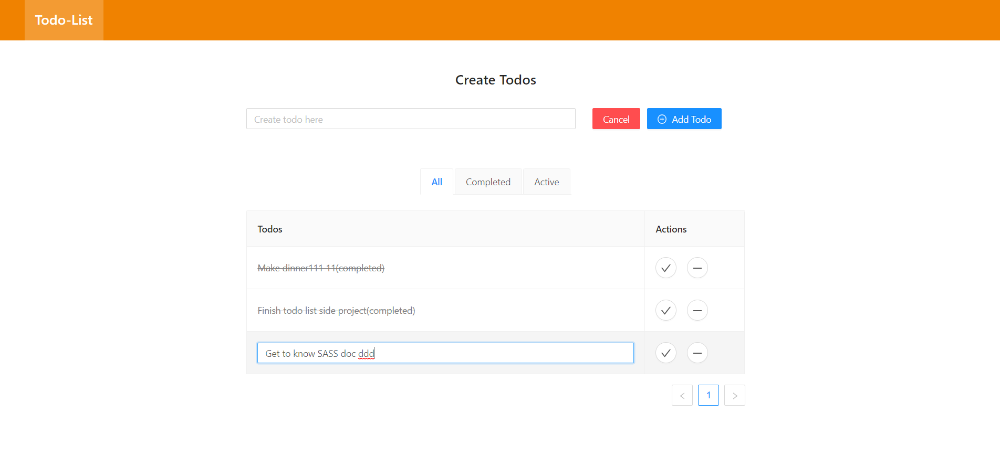

# TODO-LIST-REDUX-NEXT

This todo app use react, redux and next.js. It was created for practicing. The user can execute CRUD in this todo app. Such as add new todo, make as completed, remove a todo, and update a todo.

## Screenshots

## How to install and run

`git clone` the project, run `npm install` and then `npm dev` in your terminal.

## Available Scripts

The following scripts that you can run in the project:

Able to change the script command in `package.json`

### `npm run dev`

Runs the todo app in the development mode.
Access http://localhost:3000 to visit the app.

### `npm run build`

Builds the todo app for production.

The production files will generate in .next folder.

### `npm run start`

Runs the app in the production mode.
